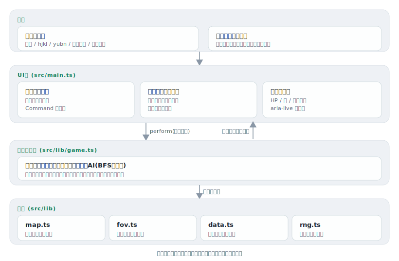

# chika

[](https://github.com/miruky/chika/actions/workflows/ci.yml)
[](https://github.com/miruky/chika/actions/workflows/deploy.yml)
[](https://www.typescriptlang.org/)
[](LICENSE)

**ブラウザで遊ぶターミナル風のローグライク。自動生成されたダンジョンを潜り、地下8階の護符を持ち帰れば勝ち。倒れれば一度きりの冒険は終わる**

デモ: https://miruky.github.io/chika/

## 概要

chikaは、文字だけで描かれた迷宮を1ターンずつ降りていくローグライクである。`@` がプレイヤー、`r` や `o` は敵、`!` は薬、`>` は下りの階段。敵のいるマスへ進むと攻撃になり、HPが尽きれば終わり、別の階へ進むには階段を見つけて降りる。視界は手元の松明ぶんだけで、壁の向こうは見えない。一度通った場所は薄く記憶として残る。

ダンジョンの形も、敵やアイテムの配置も、シード付きの乱数から決まる。同じシードなら誰の画面でも同じ迷宮が現れるので、URLを送れば同じダンジョンに挑める。プレイヤーの行動で乱数の出目はずれない ── 階層の中身はシードと階番号だけで決まるため、気に入った盤面をそのまま共有できる。

戦闘はシンプルで、与えるダメージは攻撃力から相手の防御を引いた値になる。乱数の振れがないので、勝てる相手と勝てない相手がはっきりする。深く潜るほど敵は重く硬くなり、拾った武器・防具を装備し、巻物や薬を使いどころで切る判断が問われる。

### なぜ作ったのか

ローグライクの面白さは、グラフィックではなく「見えない先へ一歩踏み込む緊張」にあると思う。だから装飾を足すより、文字盤・視界・ターンという骨格そのものを気持ちよくすることに絞った。加えて、自動生成ものは「あの面白かった盤面をもう一度」が難しい。chikaはダンジョンを完全にシード駆動にして、URL一本で同じ迷宮を再現できるようにしている。実装面では、生成・視界・戦闘・敵AIといったロジックをDOMから切り離し、ブラウザなしでテストできる形にしたかった。

## アーキテクチャ



## 技術スタック

| カテゴリ             | 技術                                 |
| :------------------- | :----------------------------------- |
| 言語                 | TypeScript 5(strict、実行時依存ゼロ) |
| ビルド               | Vite 6                               |
| テスト               | Vitest(node / jsdom)                 |
| リンタ・フォーマッタ | ESLint(typescript-eslint)+ Prettier  |
| CI / 配信            | GitHub Actions / GitHub Pages        |

## 遊び方

| 操作                   | キー                                   |
| :--------------------- | :------------------------------------- |
| 上下左右へ移動         | 矢印キー または `h` `j` `k` `l`        |
| 斜めへ移動             | `y` `u` `b` `n`(テンキー `1`-`9` も可) |
| その場で待機           | `.` または テンキー `5`                |
| 足元のアイテムを拾う   | `g` または `,`                         |
| 階段を降りる           | `>`                                    |
| 持ち物を使う・装備する | `1`-`9`(その番号のアイテム)            |
| 操作ヘルプの開閉       | `?`                                    |

敵に向かって移動すると攻撃する。薬で回復し、巻物で稲妻・炎・混乱・瞬間移動を使う。武器と防具は拾って番号キーで装備する。スマートフォンでは画面下の方向パッドと操作ボタンで遊べる。

地下8階に眠る護符を拾えば生還、HPが0になればそこで冒険は終わる(やり直しは新しい迷宮になる)。

### 同じ迷宮を共有する

シードはURLの末尾(`#seed=...`)に入る。このURLを送れば、相手の画面にも同じダンジョン・同じ初期配置が現れる。ヘッダーのシード欄に好きな文字列や数値を入れて「この種でやり直す」を押すと、その迷宮に挑める。

### ライブラリとして使う

ゲームの中核 `Game` は描画を持たない。盤面・視界・戦闘・敵の行動はこのクラスだけで完結し、`perform()` で1手ずつ進める。

```ts
import { Game } from './src/lib';

const game = new Game('42'); // 文字列でも数値でもシードになる
game.perform({ kind: 'move', dx: 1, dy: 0 }); // 右へ1歩(敵がいれば攻撃)
game.perform({ kind: 'use', index: 0 }); // 持ち物の1番を使う

game.depth; //=> 今いる階
game.player.hp; //=> 現在のHP
game.status; //=> 'playing' | 'dead' | 'won'
game.messages.at(-1); //=> { text: 'どぶねずみを倒した。', tint: 'good' }
```

`perform()` は行動がターンを消費したときだけ敵を動かす。壁に向かう・満タンで薬を飲むなど無効な手はターンを進めない。

## プロジェクト構成

- `src/lib/rng.ts` シード付き乱数(mulberry32)と文字列シードのハッシュ
- `src/lib/map.ts` 部屋と通路によるダンジョン生成。全床マスの連結を保証する
- `src/lib/fov.ts` 再帰的シャドウキャスティングによる視界計算
- `src/lib/data.ts` 敵とアイテムの定義表。階に応じた出現抽選
- `src/lib/game.ts` ターン進行・戦闘・敵AI・持ち物・階層遷移を持つ中核
- `src/lib/types.ts` ロジック層で共有する型
- `src/main.ts` 端末グリッドの描画・入力・テーマ・シード共有のUI
- `src/style.css` 配色とレイアウト、モーション
- `docs/` アーキテクチャ図

## はじめ方

### 前提条件

- Node.js 22以上

### セットアップ

```bash
git clone https://github.com/miruky/chika.git
cd chika
npm ci
npm run dev
```

### テスト・lint・ビルド

```bash
npm test
npm run lint
npm run build
```

テストは乱数の再現性、生成ダンジョンの連結性(全床マスが入口から到達できること)、視界が壁に遮られること、移動・戦闘・アイテム・階層遷移・レベルアップ、そして全8階を踏破して勝利できることまでを検査する。UIはjsdom上で起動し、盤面の描画と入力結線を確認する。

### デプロイ

mainへのpushで `deploy.yml` がGitHub Pagesへ公開する。サブパス配信のためのbaseは環境変数 `CHIKA_BASE` で渡す。

## 設計方針

- **ダンジョンはシードで決定的に作る** — 各階の地形と敵・アイテムの配置は、シードと階番号から導いた専用乱数だけで決まる。プレイヤーの行動では出目がずれない。だからURLでシードを送るだけで同じ迷宮を共有でき、テストも再現できる。
- **ロジックとDOMを分ける** — `game.ts` は描画を一切持たず、UIは状態を読んで描くだけにした。盤面生成・視界・戦闘・敵AIをブラウザなしで単体テストできる。
- **敵は距離場を下って追う** — 各ターン、プレイヤーからのBFS距離場を作り、起きている敵はその勾配を下る。袋小路や曲がった通路でも素直に追い詰め、斜めに壁の角を抜けることはしない。
- **見えない敵は動かさず、撃てない** — 視界に入った敵だけが目を覚まし、稲妻や混乱の対象になる。情報の非対称さがそのまま緊張になる。
- **キーボードを第一に、読み上げにも届ける** — 文字盤そのものは装飾として `aria-hidden` にし、戦況は `aria-live` のログと状態表示で伝える。動きは意味のある場面に絞り、`prefers-reduced-motion` で止められる。

## 制約

- 一度の冒険はリロードで失われる。シードは保存されるが、途中経過のセーブはまだない(同じシードで迷宮は作り直せる)。
- キャラクターは1種類で、職業選択や毒・再生のような持続効果はない。
- 敵AIは追跡に特化していて、群れの連携や遠隔攻撃はしない。
- 難易度は固定で、設定で変える仕組みはない。

## ライセンス

[MIT](LICENSE)
